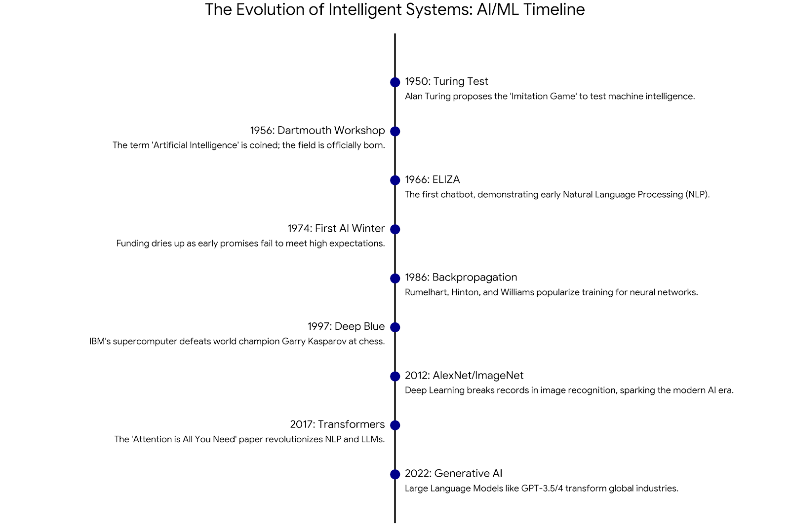

# Machine Learning Professional Portfolio
**Nikhil Kurmadasu | Senior Backend Engineer**

Welcome to my professional portfolio. This repository showcases my transition into Machine Learning and Deep Learning, combining high-level system design with advanced data analytics.

---

## **Artifact 1: Historical Evolution of AI/ML**

### **The Project**
This artifact is a curated strategic timeline designed to provide stakeholders with the historical context of intelligent systems. It identifies the major inflection points—from early Symbolism to the modern Generative era—that have shaped current enterprise AI/ML capabilities.

### **Visualization**

### **Key Insights**
* **Goal:** Ground technical decisions in a historical context for better long-term strategy.
* **Outcome:** Demonstrates an understanding of the shift from manual feature engineering to automated neural learning.
* **Skills:** Technical Strategy, Systems Thinking, Stakeholder Communication.

---

## **Artifact 2: AI-Augmented Retail Intelligence**

### **The Project**
Using the Walmart Sales dataset, I integrated Generative AI (ChatGPT-4o) into the data science workflow. I acted as a "Senior Data Scientist" persona to clean, normalize, and assess 1.2M+ records, identifying non-linear correlations that traditional manual analysis missed.

### **Key Insights**
* **Goal:** Utilize LLMs as force-multipliers for rapid data exploration and anomaly detection.
* **Outcome:** Validated AI-generated insights against manual statistical findings to ensure ethical and technical integrity.
* **Skills:** Prompt Engineering, Comparative Methodology, Anomaly Detection.

---
*Created as part of the Foundations of Data Analytics & Machine Learning curriculum.*
